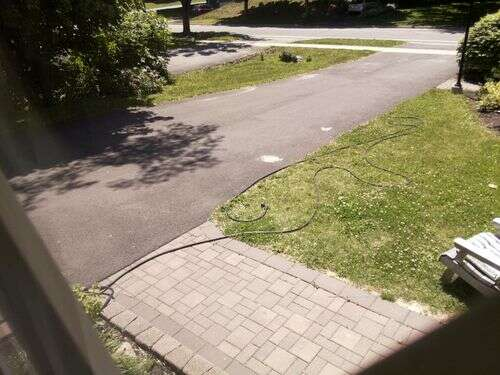
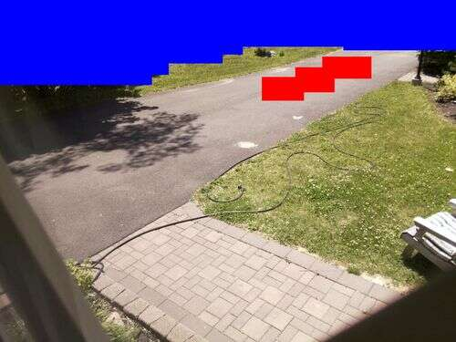

<html>
<head>
<title>Imgcomp: Configuring detection regions</title>
</head>

<h1>Imgcomp: Configuring detection regions</h1>
When monitoring a scene using a Raspberry Pi and imgcomp, there are often
regions of interest and other regions where motion is not of interest.
Vegetation and flags waving in the wind can trigger motion without
being an event of interest.

<table align=left cellspacing=0 cellpadding=0><td>

foo1.jpg - foo0.jpg:   0 at (   0,  0) (time)
fill 25-256,25-150
clear 128-256,25-75
Weight map:  '-' = ignore, '1' = normal, '#' = 2x weight
   ----------------------------------------------------------------    
   ----------------------------------------------------------------
   ----------------------------------------------------------------
   ----------------------------------------------------------------
   ----------------------------------------------------------------
   ----------------------------------------------------------------
   ----------------------------------------------------------------
   -------1111111111111111111111111--------------------------------
   -------1111111111111111111111111--------------------------------
   -------1111111111111111111111111--------------------------------
   -------1111111111111111111111111--------------------------------
   -------1111111111111111111111111--------------------------------
   -------1111111111111111111111111--------------------------------
   -------1111111111111111111111111--------------------------------
   -------1111111111111111111111111--------------------------------
   -------1111111111111111111111111--------------------------------
   -------1111111111111111111111111--------------------------------
   -------1111111111111111111111111--------------------------------
   -------1111111111111111111111111--------------------------------
   -------111111111111111111111111111111111111111111111111111111111
   -------111111111111111111111111111111111111111111111111111111111
   -------111111111111111111111111111111111111111111111111111111111
   -------111111111111111111111111111111111111111111111111111111111
   -------111111111111111111111111111111111111111111111111111111111
   -------111111111111111111111111111111111111111111111111111111111
   -------111111111111111111111111111111111111111111111111111111111
   -------111111111111111111111111111111111111111111111111111111111
   -------111111111111111111111111111111111111111111111111111111111
   -------111111111111111111111111111111111111111111111111111111111
   -------111111111111111111111111111111111111111111111111111111111
   -------111111111111111111111111111111111111111111111111111111111
   -------111111111111111111111111111111111111111111111111111111111
   -------111111111111111111111111111111111111111111111111111111111
   -------111111111111111111111111111111111111111111111111111111111
   -------111111111111111111111111111111111111111111111111111111111
   -------111111111111111111111111111111111111111111111111111111111
   -------111111111111111111111111111111111111111111111111111111111
   -------111111111111111111111111111111111111111111111111111111111
   ----------------------------------------------------------------
   ----------------------------------------------------------------
   ----------------------------------------------------------------
   ----------------------------------------------------------------
   ----------------------------------------------------------------
   ----------------------------------------------------------------
   ----------------------------------------------------------------
   ----------------------------------------------------------------
   ----------------------------------------------------------------
   ----------------------------------------------------------------
   

<td width=20><td valign=top>
By default, imgcomp will detect motion over the entire image.

The first way to configure what is of interest is to use the "region" and "exclude"
options.

The "region" option specifies a rectangle within which detection is to be performed.
Only one region can be specified.  However, it's possible to specify areas
to ignore within that region using the "exclude" option.  For example, the following
two options would produce an L shaped region of interest in 1024x768 images.

region = 100-1024,100-600
exclude = 512-1024,100-300

Imgcomp will output an ASCII representation of the happed regions.  When operating
on large images (as large as the camera will go), this map will cause line wraps
in each line, so it will messed up unless you use a small font on a large monitor.

Imgcomp will not output this map until it reads the first image.  
Prior to the first image, imgcomp does not know what
size the acquired images are.

 
Once the first image is read, if images of a different size are encountered,
imgcomp will exit.
</table>
&nbsp;

For more complex regions, specifying individual rectangles to itnore
can be cumbersome.  So another option imgcomp has is to read an
image map indicating which parts of the image to ignore.

<table align=left cellspacing=0 cellpadding=0><td>

Weight map (600x450):  '-' = ignore, '1' = normal, '#' = 2x weight
  ----------------------------------------------------------------------------------------------------
  ----------------------------------------------------------------------------------------------------
  ----------------------------------------------------------------------------------------------------
  ----------------------------------------------------------------------------------------------------
  ----------------------------------------------------------------------------------------------------
  ----------------------------------------------------------------------------------------------------
  ----------------------------------------------------------------------------------------------------
  ----------------------------------------------------------------------------------------------------
  ----------------------------------------------------------------------------------------------------
  ----------------------------------------------------------------------------------------------------
  -----------------------------------------------------1111111111111111111111-------------------------
  -----------------------------------------------------11111111111111111111111111111111111111111111111
  -------------------------------------------------1111111111111111111111##########1111111111111111111
  -------------------------------------------------1111111111111111111111##########1111111111111111111
  -------------------------------------1111111111111111111111111111111111##########1111111111111111111
  -------------------------------------1111111111111111111111111111################1111111111111111111
  ---------------------------------11111111111111111111111111111111################1111111111111111111
  ---------------------------------111111111111111111111111################111111111111111111111111111
  ---------------------------------111111111111111111111111################111111111111111111111111111
  111111111111111111111111111111111111111111111111111111111################111111111111111111111111111
  111111111111111111111111111111111111111111111111111111111##########111111111111111111111111111111111
  111111111111111111111111111111111111111111111111111111111##########111111111111111111111111111111111
  1111111111111111111111111111111111111111111111111111111111111111111111111111111111111111111111111111
  1111111111111111111111111111111111111111111111111111111111111111111111111111111111111111111111111111
  1111111111111111111111111111111111111111111111111111111111111111111111111111111111111111111111111111
  1111111111111111111111111111111111111111111111111111111111111111111111111111111111111111111111111111
  1111111111111111111111111111111111111111111111111111111111111111111111111111111111111111111111111111
  1111111111111111111111111111111111111111111111111111111111111111111111111111111111111111111111111111
  1111111111111111111111111111111111111111111111111111111111111111111111111111111111111111111111111111
  1111111111111111111111111111111111111111111111111111111111111111111111111111111111111111111111111111
  1111111111111111111111111111111111111111111111111111111111111111111111111111111111111111111111111111
  1111111111111111111111111111111111111111111111111111111111111111111111111111111111111111111111111111
  1111111111111111111111111111111111111111111111111111111111111111111111111111111111111111111111111111
  1111111111111111111111111111111111111111111111111111111111111111111111111111111111111111111111111111
  1111111111111111111111111111111111111111111111111111111111111111111111111111111111111111111111111111
  1111111111111111111111111111111111111111111111111111111111111111111111111111111111111111111111111111
  1111111111111111111111111111111111111111111111111111111111111111111111111111111111111111111111111111
  1111111111111111111111111111111111111111111111111111111111111111111111111111111111111111111111111111
  1111111111111111111111111111111111111111111111111111111111111111111111111111111111111111111111111111
  1111111111111111111111111111111111111111111111111111111111111111111111111111111111111111111111111111
  1111111111111111111111111111111111111111111111111111111111111111111111111111111111111111111111111111
  1111111111111111111111111111111111111111111111111111111111111111111111111111111111111111111111111111
   

<td width=20><td valign=top>
For the scene above, I want to ignore the bushes because they move with the wind,
the roadway, and the adjoining driveway.  So I take an image acquired by
imgcomp and paint those regions to ignore with solid blue.  Just for demonstration,
I also coloured a region in solid red to indicate high interest in this region.
Sensitivity in this region will be doubled.  The red and blue need to be
fullly saturated colours for imgcomp to use them.  For most images you can
just paint red and blue over them without the colors of the image itself triggering
as ignore or double sensitivity.

On startup, imgcomp outputs a text version of the map, shown at left.
Please note that the weight map dimensions are scaled, typically 1/4 of the image dimensions.

When using image maps, the image map must be the same dimensions as the images captured
by the camera.

